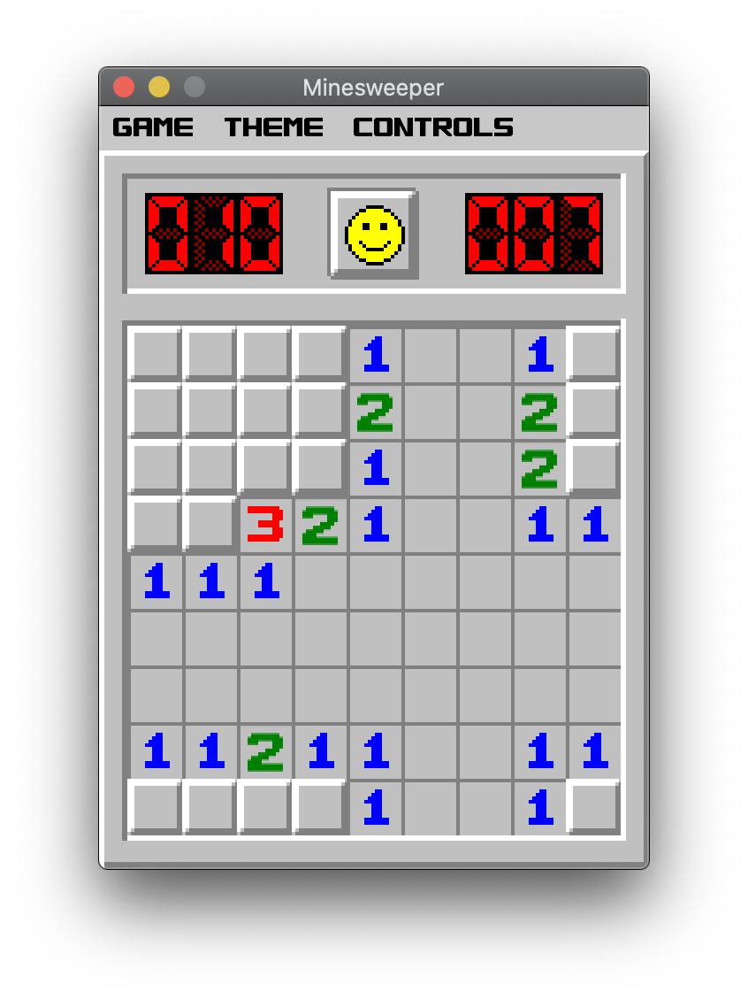
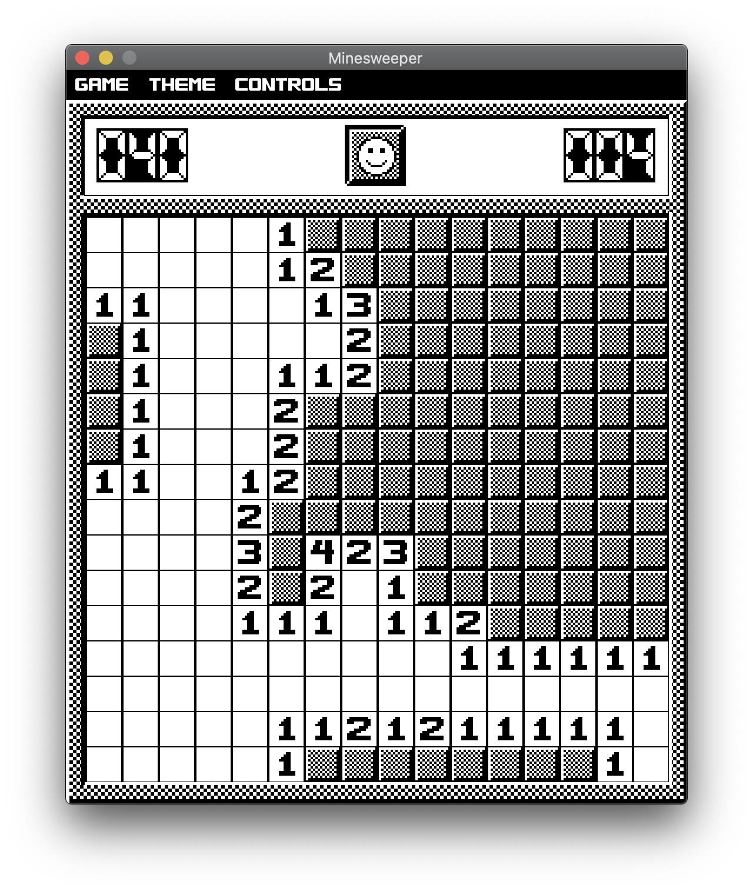
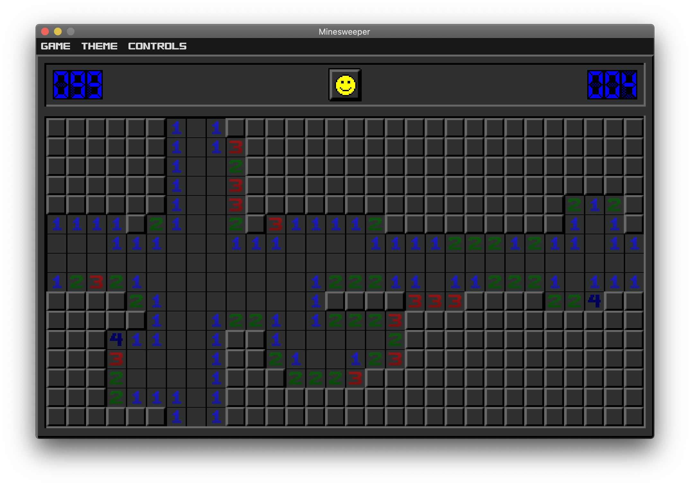

# Minesweeper
A Minesweeper clone with some extra features. Created for CS Topics: Data Structures and Game Design 2019-2020. Uses Java Swing library. 
Run `Minesweeper.jar` to play.

---

## Game
Beginner, Intermediate, and Expert difficulties are available. 
* Beginner = 9x9, 10 mines
* Intermediate = 16x16, 40 mines
* Expert = 16x30, 99 mines

_Note_: The first revealed square will be completely empty. 
---

## Theme
There are 3 themes:
* Default = same icons as the original Minesweeper
* Monochrome = black and white (created by "Black Squirrel")
* Dark = dark mode (created by me)

_Note_: Changing the theme will reset the game (will remove this in the future)

---

## Controls
* `Left-click` to reveal an empty tile
* `Right-click` an empty tile to cycle through flagged, unknown, and empty states
* Hold `middle-click` or `ctrl` + `left-click` on a tile to reveal its adjacent tiles

---

## Screenshots
### Default theme, beginner difficulty

### Monochrome theme, intermediate difficulty

### Dark theme, expert difficulty

