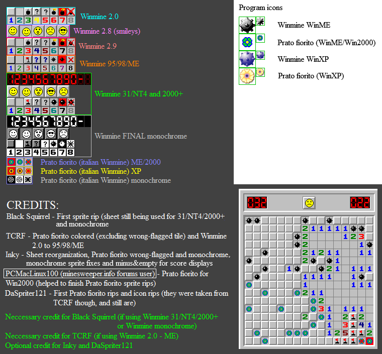

# Minesweeper
A Minesweeper clone created using Java Swing. 

Run `Minesweeper.jar` to play.

---

## Features
* Classic Minesweeper gameplay
* 3 difficulties
	* Beginner - 9x9 grid, 10 mines
	* Intermediate - 16x16 grid, 40 mines
	* Expert - 16x30 grid, 99 mines
* 3 themes
	* Default (classic Minesweeper theme)
	* Monochrome
	* Dark

---

## Controls
* `Left-click` an unrevealed tile to reveal it
* `Right-click` or `alt` + `left-click` an unrevealed tile to cycle through flagged, unknown, and empty states
* Hold `middle-click` or `ctrl` + `left-click` on a tile to reveal its adjacent tiles

---

## Credits
The sprites used in this project can be found [here](https://www.spriters-resource.com/pc_computer/minesweeper/sheet/19849/). 

---
